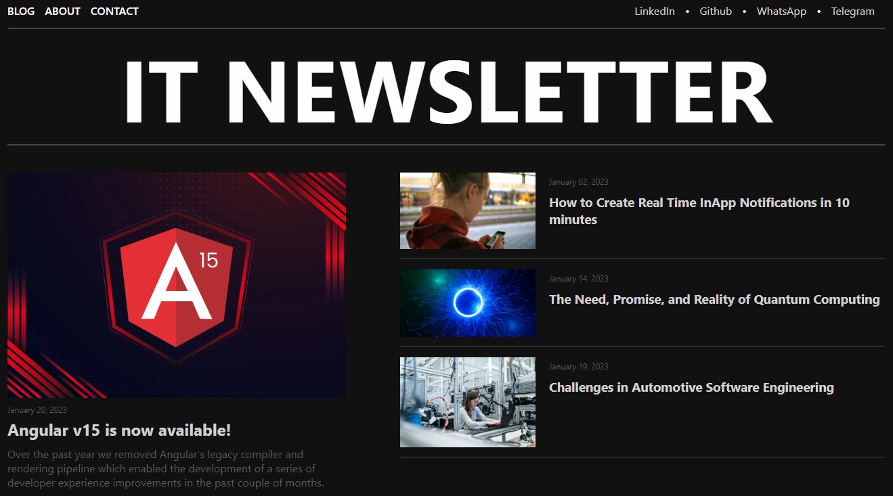

# IT Newsletter

This project is a functional blog application called IT Newsletter, built using Angular with intelligent components. It follows a responsive design concept with a geek style and utilizes HTML, CSS, and TypeScript.

## Description

The IT Newsletter project aims to provide a platform for users to browse and read tech-related articles in a visually appealing and user-friendly way. The website features a homepage that displays the latest articles, a category page that groups articles by topic, an article page that shows the full article.

## Features

- Visually appealing and user-friendly design with a geek style
- Responsive layout for optimal viewing on any device

## Technologies Used

- **Angular**
- HTML
- CSS
- TypeScript

## Usage

To access the IT Newsletter, you can either visit the deployed website or clone this repository and run the following commands in your terminal:

```
npm install
ng serve
```

The website will load automatically, and you can start browsing the different pages and features.

## Contributing

Contributions to this project are welcome! Feel free to fork this repository and submit a pull request with your changes.

## Credits

This project was built by [Francisco Silva](https://github.com/Burntroll).

## License

This project is licensed under the [MIT License](https://opensource.org/licenses/MIT).

## Results


